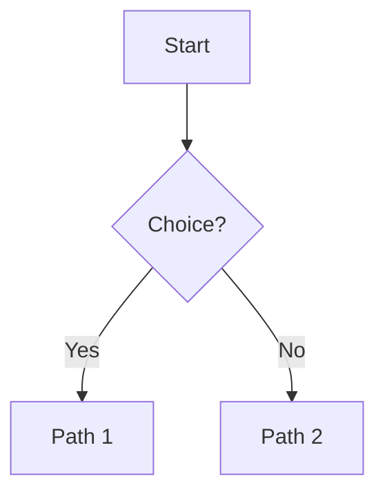

<!--more-->

# Hugo + Hextra Formatting Showcase 🎉

Welcome to the **ultimate test post**.  
This file demonstrates everything from **Markdown basics** to **Hugo templating magic**.

---

## 1. Headings & Text Styles

# H1 Heading
## H2 Heading
### H3 Heading with *italic*
#### H4 Heading with **bold**

Text styles: *italic*, **bold**, ***bold italic***, ~~strikethrough~~  

Subscript: H<sub>2</sub>O  
Superscript: E = mc<sup>2</sup>

---

## 2. Quotes & Alerts

> Normal blockquote  
>> Nested blockquote

> [!NOTE] This is a note  

> [!TIP] This is a tip

> [!IMPORTANT] Important info  

> [!WARNING] Warning message  

> [!CAUTION] Be careful!

---

## 3. Lists

### Ordered
1. First
2. Second
   1. Nested
   2. Nested
3. Third

### Unordered
- Item
- Another item
  - Sub-item

### Tasks
- [ ] Not done
- [x] Done

---

## 4. Tables

| Name   | Age | Status      |
| :----- | --: | :---------- |
| Alice  |  23 | *Student*   |
| Bob    |  27 | **Engineer**|
| Carol  |  30 | ~~Retired~~ |

---

## 5. Links & Cross References

- External: [Markdown Guide](https://www.markdownguide.org)  
- Internal: [Jump to Shortcodes](#10-shortcodes)  

---

## 6. Images

### Markdown Image


### Hugo Figure


---

## 7. Code Examples

### Inline
Here’s some `inline code`.

### Code Block
```python {filename="hello.py" linenos=table hl_lines=[2]}
def say_hello():
    print("Hello World")
```

### Hugo Highlight

<p>Hello with Hugo highlight</p>


---

## 8. Footnotes

This text has a footnote.[^1]

[^1]: This is the footnote.

---

## 9. Summaries & Read More

Content above `<!--more-->` is used as **summary** in lists.  
Below is extra content for detail pages.

---

## 10. Shortcodes

### Callouts

This is an **Info Callout**.


### Cards





### Collapsible Details

This text is **hidden by default**.


### Mermaid Diagram


### File Tree

  
    
  
  


### Icons
GitHub icon: 


Block math:
$$
F(\omega) = \int_{-\infty}^\infty f(t)e^{-j\omega t}dt
$$

### Badges
  


### YouTube


### PDF Embed


### Steps
{}

### Step 1
Install Hugo
### Step 2
Create a new site
### Step 3
Run `hugo server`
{}

### Tabs


```yaml
title: "My Site"
theme: "hextra"
```


```json
{
  "title": "My Site",
  "theme": "hextra"
}
```



---

# ✅ Done

This demo shows:  
- **Markdown basics**  
- **Hugo formatting & features**  
- **Hextra shortcodes**  

Use this as your **template** for future articles.
